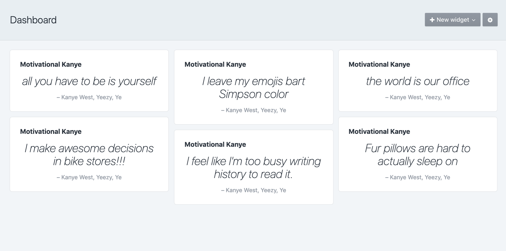

# Motivational Kanye plugin for Craft CMS 3.x

Quotes to brighten your day from one of the greatest minds of our time

## Requirements

This plugin requires Craft CMS 3.0.0-beta.23 or later.

## Installation

To install the plugin, follow these instructions.

1. Open your terminal and go to your Craft project:

        cd /path/to/project

2. Then tell Composer to load the plugin:

        composer require nfourtythree/motivational-kanye

3. In the Control Panel, go to Settings → Plugins and click the “Install” button for Motivational Kanye.

## Motivational Kanye Overview

The days of cubicle offices and classic motivational posters are declining. But how do we keep motivated?

Enter one of the greatest minds of recent times to inspire, entertain and delight. 

---

Brought to you by [Nathaniel Hammond (nfourtythree)](https://n43.me)

With big thanks to https://kanye.rest/
